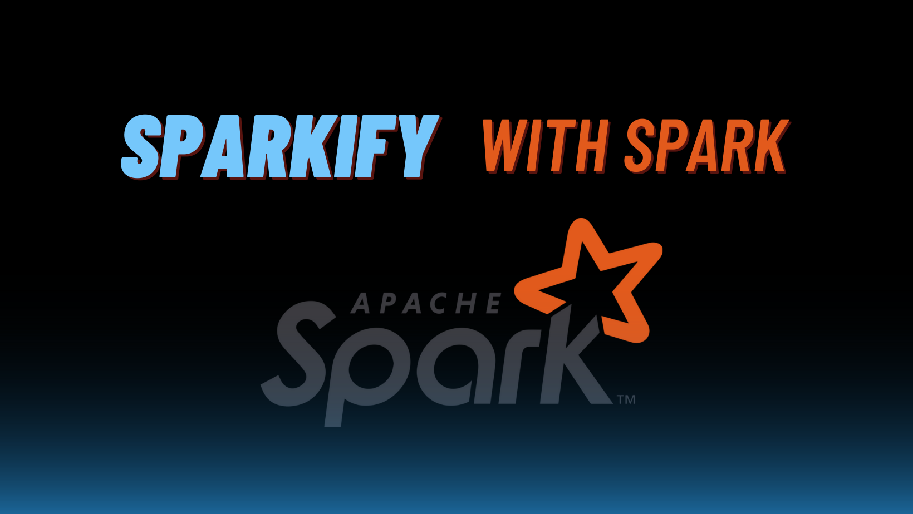
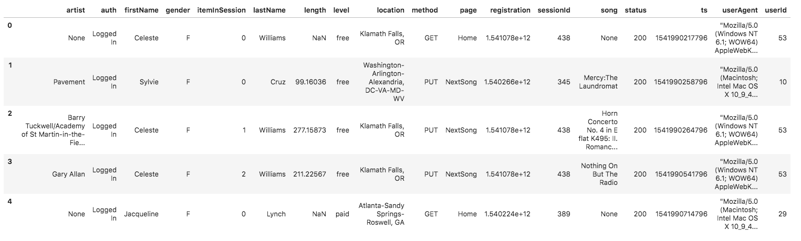
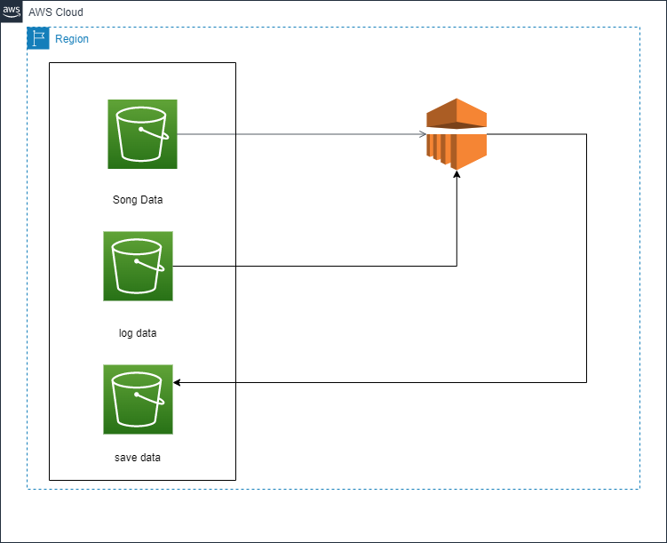
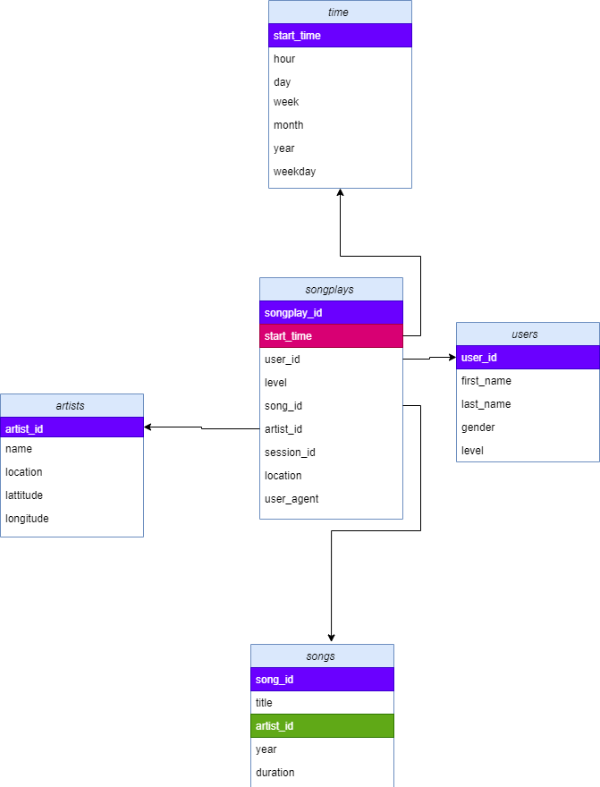

# <center>Sparkify Data Lake</center>


## Table of Contents
1. [Overview](#Overview)
2. [Introduction](#Introduction)
2. [Dataset Description](#Dataset-Description)
4. [Description](#Description)
5. [Usage](#Usage)
6. [Files](#Files)
7. [Libreries and tools](#Libreries-and-tools)
8. [About me](#About-me)
## Overview  👓
This project was provided as part of Udacity's Data Engineering Nanodegree program, you can [see all the Nano Degree projects from here](https://github.com/mohamedbakhet/Data-Engineering-Udacity-Nano-Degree-Program-).
___

## Introduction
A music streaming startup, Sparkify, has grown their user base and song database even more and want to move their data warehouse to a data lake. Their data resides in S3, in a directory of JSON logs on user activity on the app, as well as a directory with JSON metadata on the songs in their app.

As their data engineer, the task is building an ETL pipeline that extracts their data from S3, processes them using Spark, and loads the data back into S3 as a set of dimensional tables. This will allow their analytics team to continue finding insights in what songs their users are listening to.

## Dataset Description

we have two datasets that reside in S3. Here are the S3 links for each:

- [Song data](s3://udacity-dend/song_data)

- [Log data](s3://udacity-dend/log_data)


### Song Dataset
The first dataset is a subset of real data from [the Million Song Dataset](http://millionsongdataset.com/). Each file is in JSON format and contains metadata about a song and the artist of that song. The files are partitioned by the first three letters of each song's track ID. For example, here are file paths to two files in this dataset.
```
song_data/A/B/C/TRABCEI128F424C983.json
song_data/A/A/B/TRAABJL12903CDCF1A.json
```
And below is an example of what a single song file,

TRAABJL12903CDCF1A.json, looks like.
```
{"num_songs": 1,
"artist_id": "ARJIE2Y1187B994AB7", 
"artist_latitude": null,
"artist_longitude": null,
"artist_location": "",
"artist_name": "Line Renaud", 
"song_id": "SOUPIRU12A6D4FA1E1",
"title": "Der Kleine Dompfaff", 
"duration": 152.92036,
"year": 0}
```
### Log Dataset

The second dataset consists of log files in JSON format generated by this [event simulator](https://github.com/Interana/eventsim) based on the songs in the dataset above. These simulate app activity logs from an imaginary music streaming app based on configuration settings.

The log files in the dataset you'll be working with are partitioned by year and month. For example, here are file paths to two files in this dataset.
```
log_data/2018/11/2018-11-12-events.json
log_data/2018/11/2018-11-13-events.json
```
And below is an example of what the data in a log file.

2018-11-12-events.json, looks like.



## Description

In this project, will apply knowledge and experience   on Spark and data lakes to build an ETL pipeline for a data lake hosted on S3. To test the project, you will need to load data from S3, process the data into analytics tables using Spark, and load them back into S3. You'll deploy this Spark process on a cluster using AWS.



the below image represents the

### Fact Table
songplays
records in log data associated with song plays i.e. records with page NextSong
>	songplay_id, start_time, user_id, level, song_id, artist_id, session_id, location, user_agent.

### Dimension Tables
**users**

users in the app
>	user_id, first_name, last_name, gender, level

**songs**

songs in music database
>	song_id, title, artist_id, year, duration

**artists**

artists in music database
>	artist_id, name, location, latitude, longitude

**time**

timestamps of records in songplays broken down into specific units
>	start_time, hour, day, week, month, year, weekday




## Usage 

---
1. prepare Environment  install python 
2. insert the configuration of your AWS account and the role which will be used on dl.cfg file
```
KEY=YOUR_AWS_ACCESS_KEY
SECRET=YOUR_AWS_SECRET_KEY
```
3. Add output S3 Bucket named sparkify-dend where output results will be stored (can create new s3 Bucket).

4. run ``etl.py `` from terminal or cmd through the below command line or any python IDE to load data from AWS s3 bucket and insert into the Aws redshift. 
```
python etl.py
```
5. don't forget to close any service opening to avoid extra chargings 

## Files
---
### create_tables.py 
A python script to start connection with AWS and create and configure the tables on AWS Redshift.
### dl.cfg
a configuration file to configure the connection on AWS Redshift like
HOST, DB_NAME, DB_USER, DB_PASSWORD, DB_PORT, ARN and the links of the dataset.
### etl.py  
A python script to start connection with AWS and load and insert the dataset into AWS Redshift.
### sql_query.py 
A python script has a sql queries to drop and create tables on data warehouse and execute other  SQL queries to insert into the tables.


## Libreries and tools 
---

>* juputer notebook 
>* python 
>* AWS Redshift
>* text editor


## About me
---
I'm mohamed bekheet, you con browser other repository on my [github profile](https://github.com/mohamedbakhet) and view my [linkedin page](https://www.linkedin.com/in/mohamedbekheet-/) and [kaggle profile](https://www.kaggle.com/mohamedbakhet) and you can contect with me throgth mohamedbekheet33@gmail.com